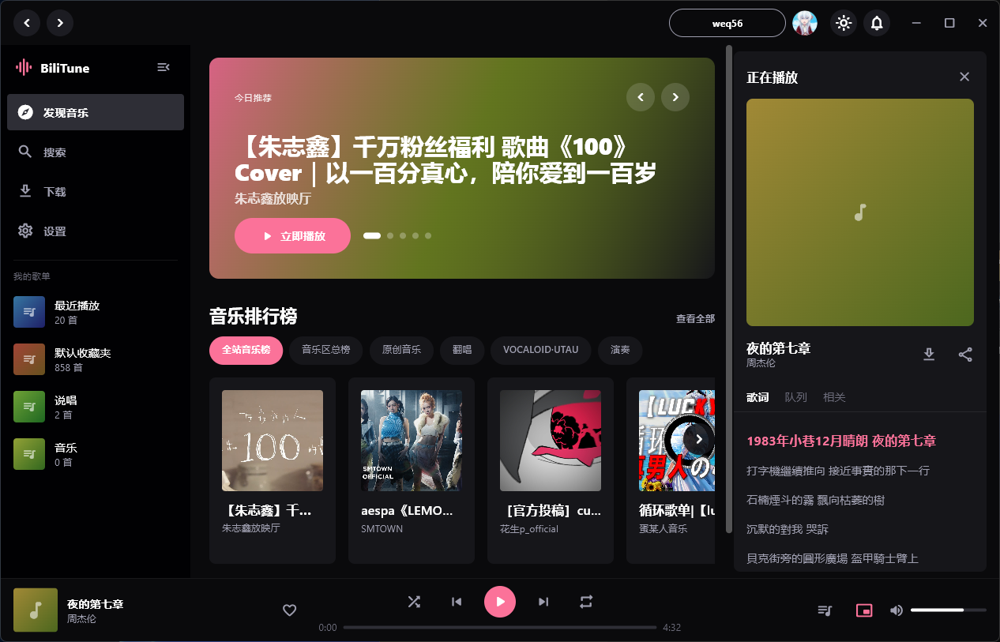
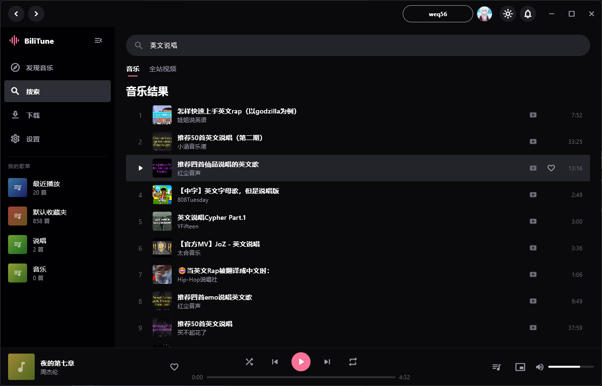
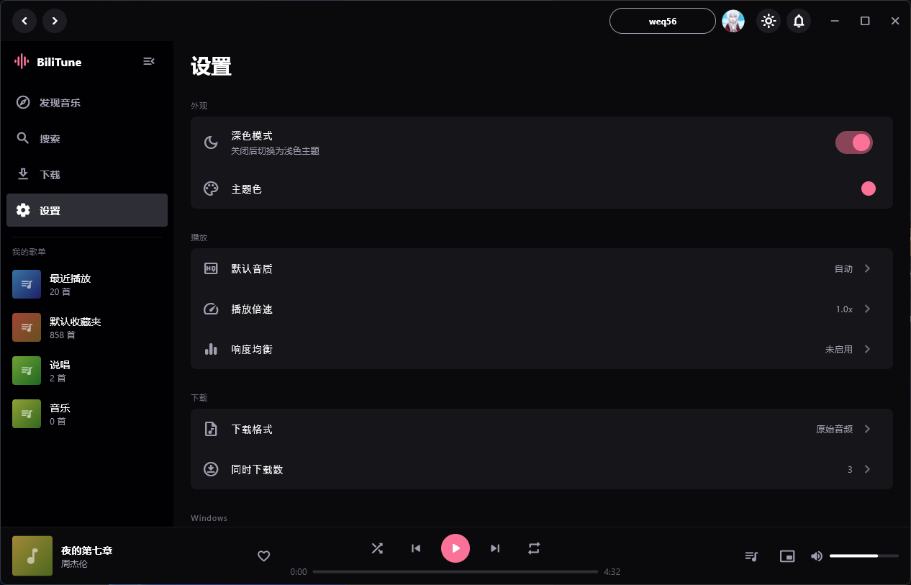
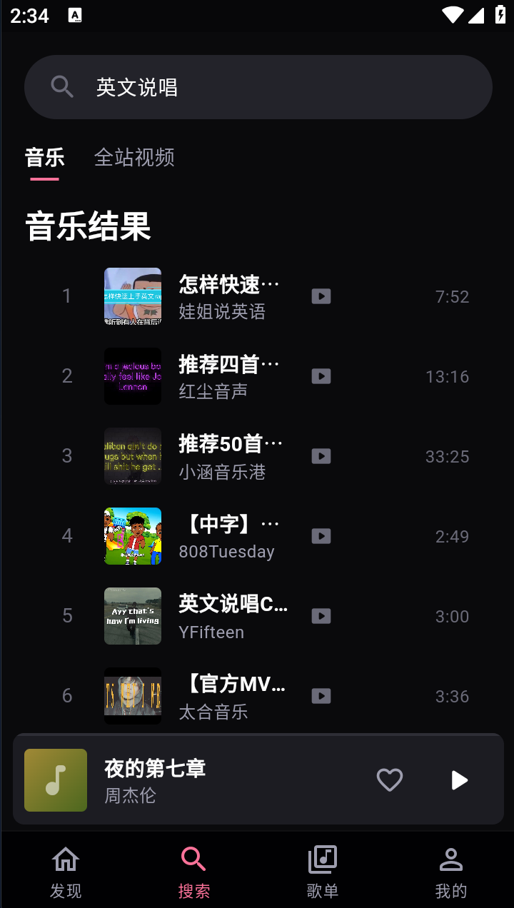

# BiliTune

<div align="center">
  
</div>

### 这是什么？
```
模仿Youtube music的思路、Spotify的前端制作的哔哩哔哩音乐播放器
```
### 有什么特点？
```
- 支持Windows、Android双端（或许还会支持更多？）
- 把B站账号的收藏夹当作歌单，在app内可以创建新的收藏夹，添加视频进入收藏
- 从视频字幕或网易yun等平台获取歌词
- flutter制作，多端支持优异，内存占用小
- 好看的ui/ux，轻松易懂的使用方式
- 尊重Bilibili bot协议，严格限制api调用频率，避免为上游增加压力以及触发风控
```

## 截图
<table>
  <tr>
    <td align="center"></td>
    <td align="center"></td>
    <td align="center"></td>
  </tr>
  <tr>
    <td align="center"></td>
    <td align="center"></td>
    <td align="center"></td>
  </tr>
</table>

- 在静态网页 [预览](https://wep-56.github.io/BiliTune/) 桌面端与移动端设计

## Getting Started
### 非开发者
前往[release](https://github.com/WEP-56/BiliTune/releases)下载对应设备的安装包
### 开发者

## 致谢
参考了以下优秀项目

api来自：[Nemo2011/bilibili-api](https://github.com/Nemo2011/bilibili-api)

